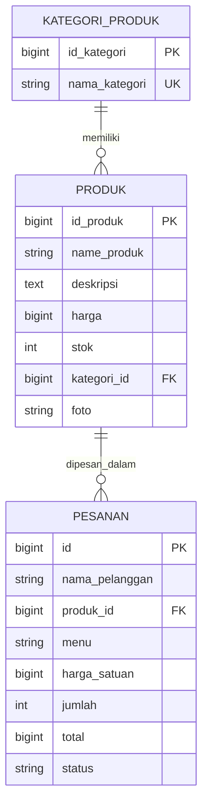

# Toko Kue

Aplikasi toko kue berbasis **Laravel 12** yang dibuat sebagai proyek portofolio. Aplikasi ini mencakup katalog customer, pengelolaan produk dan stok oleh admin, alur pesanan dan pembayaran, penugasan pengantaran, serta laporan penjualan.

> **Status proyek:** alur aplikasi dan pengujian otomatis tersedia. Hitung ongkir memerlukan alamat toko dan Google Routes API key. Notifikasi WhatsApp memerlukan konfigurasi WhatsApp Cloud API dan worker antrean. Integrasi eksternal tersebut belum aktif secara default.

## Fitur

- **Autentikasi dan peran pengguna**: akses customer dan admin dibedakan, dengan pembatasan percobaan login.
- **Dashboard**: ringkasan jumlah kategori, menu, pesanan hari ini, pendapatan, daftar pesanan terbaru, dan peringatan **stok menipis**.
- **CRUD Kategori**: nama kategori unik, dan kategori yang masih dipakai menu tidak bisa dihapus.
- **CRUD Menu Kue**: upload foto (JPG/PNG/WebP, maks 2 MB), foto lama otomatis dihapus saat diganti atau menu dihapus.
- **Pesanan**: pilih menu, total dihitung di server, stok berkurang otomatis, dan ditolak jika stok tidak cukup.
- **Pengiriman**: jarak rute dapat dihitung dari alamat toko ke alamat customer melalui Google Routes API; customer memilih layanan Cepat, Hemat, atau Lambat, lalu admin mengonfirmasi ongkir dan jadwal sebelum pembayaran.
- **Pembaruan WhatsApp**: notifikasi status melalui WhatsApp Cloud API hanya untuk customer yang memberi persetujuan; hasil kirim/gagal tercatat di pengaturan.
- **Laporan penjualan**: filter rentang tanggal, preview di browser, dan unduh PDF.
- **Tabel interaktif** (pencarian, urutan, pagination) dan konfirmasi hapus dengan SweetAlert2.

## Teknologi

| Bagian | Teknologi |
| --- | --- |
| Backend | PHP 8.2+, Laravel 12 |
| Database | SQLite (default) atau MySQL |
| Frontend | Blade, Bootstrap 5, AdminLTE 4, DataTables, SweetAlert2 |
| PDF | barryvdh/laravel-dompdf |
| Testing | PHPUnit 11, GitHub Actions |

## Menjalankan proyek di Windows

Prasyarat: PHP 8.2+ (ekstensi `gd`, `mbstring`, `pdo_sqlite`), Composer.

```powershell
git clone https://github.com/USERNAME/toko-kue.git
cd toko-kue
composer install
composer setup
php artisan serve
```

`composer setup` menyalin `.env.example` menjadi `.env` jika `.env` belum ada, membuat application key, menyiapkan database SQLite, menjalankan migrasi dan data demo, lalu membuat storage link.

Buka http://127.0.0.1:8000. Akun demo lokal:

| Email | Password |
| --- | --- |
| Admin | `admin@tokokue.test` / `password` |
| Customer | `pelanggan@tokokue.test` / `password` |

> Akun dan password tersebut hanya untuk demo lokal. Jangan gunakan konfigurasi demo untuk aplikasi produksi atau server publik.

### Prasyarat

- PHP 8.2 atau lebih baru dan Composer.
- Ekstensi PHP `gd`, `mbstring`, dan `pdo_sqlite`.
- Git untuk meng-clone repository.

Node.js tidak diperlukan untuk menjalankan halaman aplikasi saat ini. Antarmuka menggunakan aset yang tersedia di proyek dan layanan CDN.

### Pengiriman dan notifikasi WhatsApp

Ongkir memakai jarak rute berkendara dari alamat toko di menu Pengaturan ke alamat pengiriman customer. Customer tidak memasukkan jarak; setelah memasukkan alamat, sistem meminta Google Maps menghitung rute, lalu menampilkan pilihan Cepat, Hemat, dan Lambat dengan tarif masing-masing. Tarif dihitung dari jarak rute dikalikan tarif per km yang diatur admin; Hemat dapat gratis sampai ambang jarak yang ditentukan admin. Harga tetap menunggu konfirmasi akhir admin sebelum customer membayar. Tanpa konfigurasi Google Maps, checkout pengiriman tidak dapat menyelesaikan perhitungan ongkir.

Perhitungan rute membutuhkan Google Routes API yang aktif dan API key server. Isi `GOOGLE_MAPS_SERVER_KEY` di `.env`, batasi key pada Google Routes API dan server toko, lalu jalankan `php artisan config:clear`. Admin perlu memastikan alamat toko yang sebenarnya dan selengkapnya sudah tersimpan di Pengaturan. Jika API key atau alamat toko belum tersedia, customer tidak dapat menyelesaikan checkout; sistem tidak mengganti jarak sebenarnya dengan ongkir tebakan. Alamat tujuan dikirim ke Google Maps untuk perhitungan jarak. Tarif contoh bisa diubah dari Pengaturan.

Nomor rekening dan e-wallet toko disimpan admin di Pengaturan, bukan diminta berulang kali di checkout. Tujuan pembayaran baru ditampilkan di detail pesanan setelah admin mengonfirmasi ongkir dan jadwal; bukti pembayaran lalu diunggah dari halaman pesanan customer.

Pengiriman WhatsApp otomatis membutuhkan WhatsApp Cloud API, token akses, Phone Number ID, dan template pesan yang telah disetujui Meta. Isi variabel `WHATSAPP_CLOUD_ACCESS_TOKEN`, `WHATSAPP_CLOUD_PHONE_NUMBER_ID`, `WHATSAPP_CLOUD_TEMPLATE`, `WHATSAPP_CLOUD_LANGUAGE`, dan `WHATSAPP_CLOUD_API_VERSION` pada `.env`, lalu jalankan `php artisan config:clear`. Template harus memiliki lima parameter body dengan urutan nama customer, kode pesanan, status, rincian ongkir/pembaruan, dan jadwal. Jalankan worker antrean (`php artisan queue:work`) agar pesan dikirim di latar belakang. Jangan memasukkan token ke pengaturan database atau membagikannya. Pesan hanya dikirim jika customer mencentang persetujuan WhatsApp saat checkout. Tanpa konfigurasi Cloud API, pesanan tetap berfungsi dan status notifikasi tercatat sebagai belum dikonfigurasi.

### Memakai MySQL (misalnya XAMPP)

Buat database **baru dan kosong** (misalnya lewat phpMyAdmin), lalu ubah bagian database di `.env`:

```env
DB_CONNECTION=mysql
DB_HOST=127.0.0.1
DB_PORT=3306
DB_DATABASE=toko_kue
DB_USERNAME=root
DB_PASSWORD=
```

Kemudian jalankan `php artisan migrate --seed`.

> Buat database kosong sebelum migrasi pertama. Hindari `migrate:fresh` pada database yang berisi data karena perintah tersebut menghapus seluruh tabel.

## Pemecahan masalah

| Pesan error | Penyebab | Solusi |
| --- | --- | --- |
| `Failed opening required '.../vendor/autoload.php'` | Dependensi belum dipasang | `composer install` |
| `Your Composer dependencies require a PHP version >= 8.2` | PHP di komputer terlalu lama (XAMPP lama memakai 8.0/8.1) | Pakai PHP 8.2+ (update XAMPP atau pakai Laragon) |
| `could not find driver` | Ekstensi database PHP belum aktif | Aktifkan `pdo_sqlite` (atau `pdo_mysql`) di `php.ini`, lalu restart |
| `Table 'kategori_produk' already exists` | Skema lama sudah berisi tabel dengan nama yang sama | Buat database baru yang kosong, lalu jalankan `php artisan migrate --seed` |
| `SQLSTATE[HY000] [2002] Connection refused` | MySQL belum menyala | Start MySQL di XAMPP/Laragon, cek `DB_HOST` dan `DB_PORT` |
| `Unknown database 'toko_kue'` | Database belum dibuat | Buat database `toko_kue` dulu |
| `No application encryption key has been generated` | `.env` belum punya `APP_KEY` | `php artisan key:generate` |
| `Class "App\\Models\\produk" not found` atau error class/route lama | File lama tercampur atau cache lama | `composer dump-autoload` lalu `php artisan optimize:clear` |
| Foto tidak tampil | Symlink storage belum ada | `php artisan storage:link` (di Windows jalankan terminal sebagai Administrator) |
| Halaman error setelah mengganti `.env` | Konfigurasi lama tersimpan di cache | `php artisan optimize:clear` |

> Jika `.env` sudah ada dari proyek lama, `composer setup` tidak menimpanya. Hapus `.env` lama atau samakan isinya dengan `.env.example` sebelum menjalankan setup.

## Menjalankan test

```bash
composer test
```

Jalankan seluruh pengujian dengan:

```powershell
php artisan test --compact
```

Test mencakup autentikasi, CRUD kategori dan menu, logika stok pesanan, perhitungan ongkir (menggunakan respons API tiruan), pembayaran, penugasan driver, notifikasi WhatsApp, filter laporan, dan unduhan PDF. Pengujian tidak mengaktifkan atau menghubungi layanan Google Maps/WhatsApp yang sebenarnya.

## Struktur dan keputusan teknis

```
app/
├── Http/
│   ├── Controllers/     Controller tipis, satu per fitur
│   └── Requests/        Validasi lewat Form Request
├── Models/              Kategori, Produk, Pesanan, User
└── Services/
    └── PesananService   Logika stok dalam transaksi database
database/
├── migrations/          Skema lengkap dengan foreign key
├── seeders/             Data contoh toko kue + akun admin
└── factories/           Dipakai oleh test
```

- **Stok konsisten.** `PesananService` membuat, mengubah, dan menghapus pesanan di dalam transaksi dengan `lockForUpdate()`, sehingga dua pesanan bersamaan tidak bisa membuat stok minus. Mengubah atau menghapus pesanan otomatis mengembalikan stok.
- **Total tidak dipercaya dari form.** Harga diambil dari database di server, sehingga nilai total dari browser tidak bisa dimanipulasi.
- **Riwayat pesanan aman.** Nama menu dan harga satuan disimpan sebagai snapshot di tabel `pesanan`, jadi riwayat tetap utuh walau menu kemudian dihapus atau harganya berubah.
- **Integritas data.** Foreign key `restrictOnDelete` mencegah kategori terhapus jika masih dipakai, dan `nullOnDelete` menjaga pesanan saat menu dihapus.
- **Pendapatan** dihitung hanya dari pesanan berstatus *Selesai*.

## Skema database



## Kredit

- Template dashboard: [AdminLTE](https://adminlte.io) (lisensi MIT, salinannya ada di `public/assets/ADMINLTE-LICENSE`).
- Gambar hero di `public/images/login-hero.jpg` dibuat dengan ChatGPT/OpenAI; penggunaan output mengikuti [Ketentuan Penggunaan OpenAI](https://openai.com/policies/terms-of-use/) dan hukum yang berlaku.
- Dibangun dengan [Laravel](https://laravel.com).

## Lisensi

[MIT](LICENSE)
